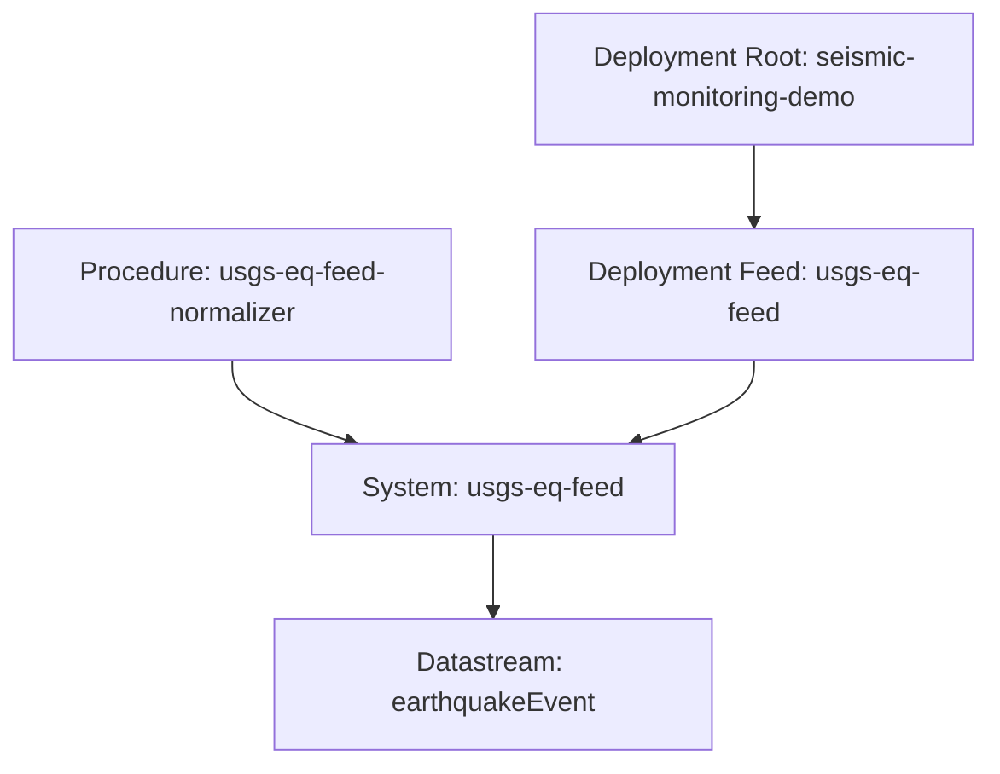

# Resource Model

## Current modeled resources

The current USGS earthquake publisher uses a Pattern C feed-adapter model:

- 1 shared earthquake normalization procedure
- 1 feed-adapter system
- 1 earthquake datastream
- 1 root deployment
- 1 feed deployment

## Resource graph

## Upstream source mapping

### Procedure

Represents the acquisition and normalization workflow that converts the USGS
GeoJSON earthquake summary feed into one CSAPI observation per event.

Primary upstream references:

- GeoJSON Summary Feed documentation
- GeoJSON Detail Feed documentation
- ComCat documentation
- FDSN Event Web Service documentation

### System

Represents a global feed adapter, not a physical seismic station.

The current system geometry is a conceptual anchor at the USGS National
Earthquake Information Center location in Golden, Colorado. It is not the
geometry of any earthquake event.

### Datastream

Represents the normalized earthquake-event feed. Each observation corresponds
to one earthquake feature from the selected summary feed variant.

Primary upstream sources:

- `summary/{variant}.geojson`
- per-event `detail` links from the summary feed

### Observations

Represent single earthquake events emitted as CSAPI observations.

Primary upstream source:

- summary feed feature fields

Optional future enrichment sources:

- detail feed `products`
- FDSN `query.geojson`

## Current contract boundaries

The current publisher deliberately keeps the observation result body small and
summary-feed based.

Current result fields:

- `eventId`
- `magnitude`
- `magType`
- `place`
- `eventTime`
- `updatedTime`
- `latitude`
- `longitude`
- `depth_km`
- `status`
- `eventType`
- `title`
- `detailUrl`

This is a reasonable contract because:

- the event identifier is stable and usable for dedupe
- the result body stays aligned with the summary feed the runtime already polls
- richer product-level information is available through the detail feed without
  forcing per-cycle secondary requests

## Important model constraints

The current implementation intentionally does not create one system per earthquake.

This is correct because:

- earthquakes are transient observations, not long-lived deployed systems
- the feed-adapter pattern keeps bootstrap size small and runtime registration stable
- event geography belongs with the observation, not with the feed adapter system

The current runtime also intentionally does not fetch the detail feed for every event.

That is a good default because:

- summary feeds are designed for real-time polling
- detail documents are richer but materially larger and more variable
- the current Explorer and demo story do not require full product fan-out

## Recommended enrichment boundaries

### Put at procedure or system level

- official USGS source references
- feed variant documentation
- feed lifecycle policy
- explicit statement that the system is a feed adapter and not a physical seismic station

### Put at datastream level

- current result contract
- omitted-but-available summary fields such as `sig`, `tsunami`, `alert`, and `net`
- detail-feed and FDSN companion-source references
- explicit dedupe semantics

### Keep out of the default result body for now

- `products`
- full origin uncertainty fields
- product contents URLs
- contributor-specific derived products such as `nearby-cities` and `scitech-link`

These are important, but they are better treated as optional future enrichment
paths than as mandatory runtime fields for the baseline publisher.
