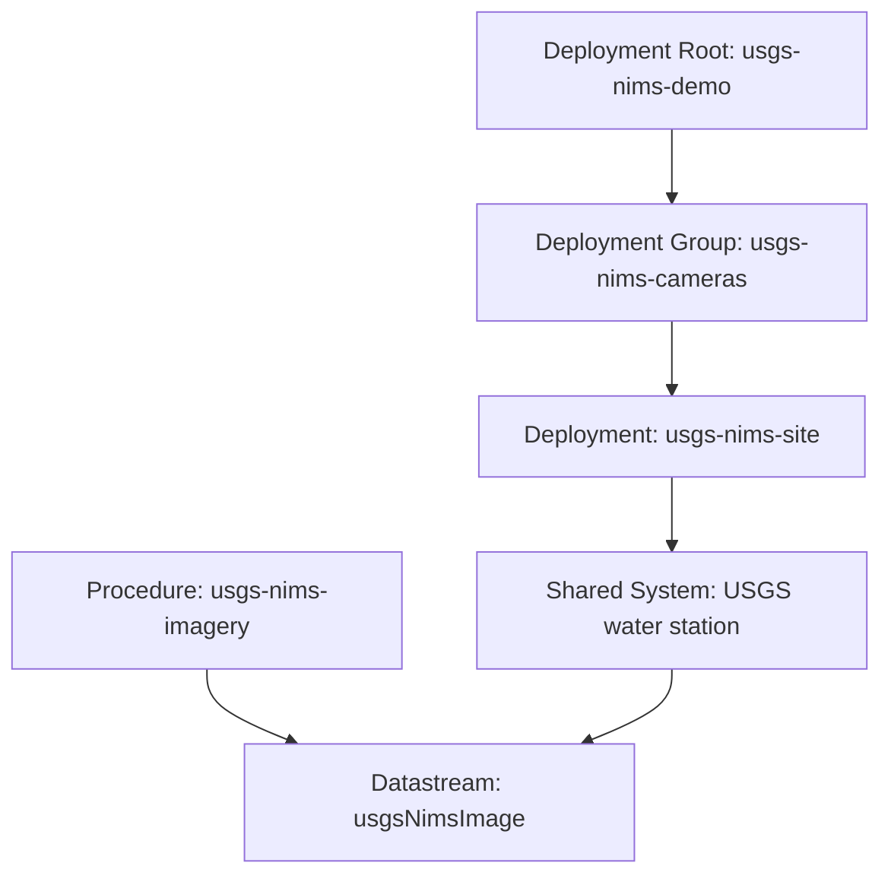

# Resource Model

## Current modeled resources

The current USGS NIMS publisher uses a shared-system Pattern A model:

- 1 shared NIMS procedure
- 0 NIMS-specific systems
- 1 imagery datastream per curated camera
- imagery datastreams attached to existing USGS water station systems
- 1 root deployment
- 1 grouping deployment
- 1 deployment per curated camera/site

## Resource graph

## Upstream source mapping

### Procedure

Represents the acquisition and normalization workflow that converts USGS NIMS
camera and filename responses into CSAPI image-reference observations.

Primary upstream references:

- `cameras`
- `listFiles`
- NIMS S3 image bucket

### Shared system

Represents the existing USGS water monitoring location from the USGS water publisher.

The NIMS publisher does not create or own this system. It reuses it.

### Datastream

Represents one selected NIMS camera attached as a companion datastream on the
shared USGS water station system.

Primary upstream sources:

- `cameras?camId=...`
- `listFiles?camId=...`

### Observations

Represent single image-reference observations published to one NIMS datastream.

Primary upstream sources:

- `listFiles`
- directory paths from the camera object

## Current contract boundaries

The current publisher deliberately keeps the observation result body small and URL-focused.

Current result fields:

- `stationId`
- `camId`
- `imageUrl`
- `thumbUrl`
- `smallUrl`
- `mediaType`
- `filename`
- `timeLapseUrl`

This is a reasonable contract because:

- the datastream identity already anchors the selected camera
- the result body is intended to drive image rendering, not to mirror every upstream field
- camera identity and cadence are better represented as metadata first

## Important model constraint

The current implementation assumes one selected camera per shared station system.

Evidence:

- the bootstrap uses one fixed `outputName` (`usgsNimsImage`)
- the publisher deduplicates by `nwisId`
- the curated config currently selects one camera per station

This works for the current curated demonstration set, but it is not a general
multi-camera-per-site model.

## Recommended enrichment boundaries

### Put at datastream level

- `camName`
- `camDesc`
- `TL_enabled`
- `ingest.period`
- `ingest.intr`
- `modifiedDate`
- `newestImageDT`
- direct `cameras` and `listFiles` query references

### Put at deployment level

- Pattern A shared-system explanation
- recent-images query link
- timelapse link when applicable
- selected-camera identity for the site

### Keep out of the result body for now

- `createdDate`
- `modifiedDate`
- `newestImageDT`
- `ingest.period`
- `ingest.intr`
- `locus`
- `fs`

These fields are important, but they are better treated as metadata or future
optional runtime extensions rather than default observation payload.
