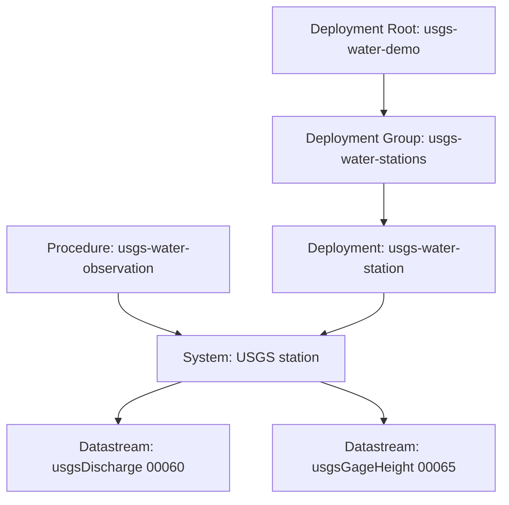

# Resource Model

## Current modeled resources

The current USGS water publisher uses a station-centric model:

- 1 shared procedure
- 1 system per curated USGS monitoring location
- 2 datastreams per station system
- 1 root deployment
- 1 grouping deployment
- 1 deployment per station

## Resource graph

## Upstream source mapping

### Procedure

Represents the acquisition and normalization workflow that converts USGS Water
Data OGC API responses into CSAPI observations.

Primary upstream references:

- OGC API landing page
- OpenAPI document
- `continuous`
- `latest-continuous`
- `time-series-metadata`

### System

Represents one curated USGS monitoring location.

Primary upstream source:

- `monitoring-locations`

Optional enrichment source:

- `combined-metadata`

### Datastream

Represents one parameter family at one station.

Current families:

- `00060` discharge
- `00065` gage height

Primary upstream sources:

- `latest-continuous` or `continuous`
- `time-series-metadata`

Important semantic anchor:

- `statistic_id=00011` instantaneous values

### Observations

Represent single instantaneous values published to one datastream.

Primary upstream source:

- `latest-continuous` or `continuous`

## Current contract boundaries

The current publisher deliberately keeps the observation result body small.

This is the current design:

- datastream identity carries parameter semantics and units
- the O&M envelope carries `phenomenonTime`
- the result body carries only station id, value, qualifier, and approval status

This is a reasonable contract because:

- one datastream already implies parameter family
- units are stable per datastream
- `time_series_id` and `statistic_id` are provenance, not necessarily primary UI fields

## Recommended enrichment boundaries

### Put at datastream level

- `parameter_code`
- `parameter_description`
- `statistic_id=00011`
- `unit_of_measure`
- exact upstream collection query references
- explanation of `time_series_id`

### Put at system level

- site type
- agency and district
- altitude and vertical datum
- coordinate accuracy and method
- daylight savings usage
- HUC and drainage area

### Keep out of the result body for now

- `unit_of_measure`
- `parameter_code`
- `statistic_id`
- `time_series_id`
- `last_modified`

These should remain optional future extensions rather than immediate contract changes.
